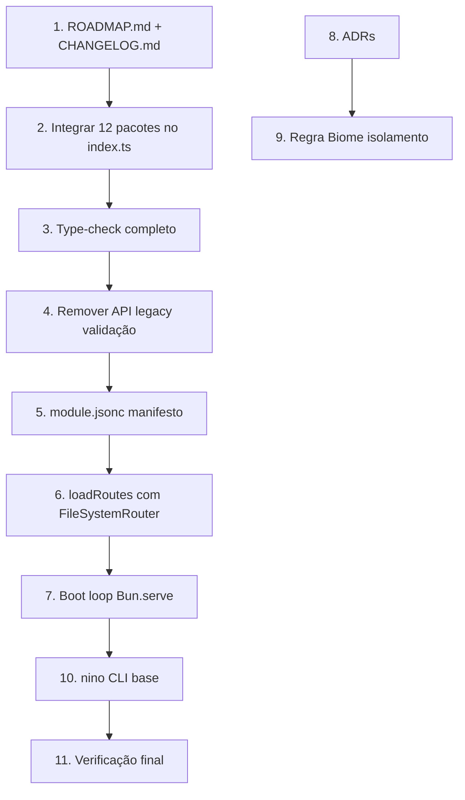

# Sprint 1 — Foundation: Estabilizar Core + Ecossistema v0.3

> Sprint Goal: Integrar os 18 pacotes no entry point, criar ROADMAP.md, remover API legacy de validação, e estabelecer a base TDD do framework ninoTS v0.3.
> Branch: `feature/sprint-1`
> Estimated effort: 2–3 semanas
> Planner: Ravi | Orchestrator: Caio

---

## Decomposição (Yara — Thinker)

### Análise de Risco

| Risco | Impacto | Mitigação |
|-------|---------|-----------|
| Pacotes não exportados podem ter tipos quebrados | Alto | Type-check incremental após cada integração |
| Remover API legacy pode afetar testes existentes | Médio | Verificar cobertura de testes antes de deletar |
| `module.jsonc` é formato novo, precisa de loader | Baixo | Bun importa `.jsonc` nativamente |
| `Bun.FileSystemRouter` suporta apenas estilo `nextjs` | Médio | Wrapper fino que abstrai o estilo, futuro-proof |
| Boot loop complexo pode falhar em ordem de init | Alto | Testes unitários por fase do boot |

### Dependências entre tarefas

---

## Prioritized Task List

| # | Task | Persona | Est | Fase | Descrição |
|---|------|---------|-----|------|-----------|
| 1 | Criar `ROADMAP.md` | Leo (docs) | 1h | 1 | Roadmap v0.3 → v0.5 → v1.0 no framework |
| 2 | Integrar 12 pacotes no `index.ts` | Davi (executor) | 3h | 1 | Exportar auth, cache, config, encryption, filesystem, hashing, logger, orm, session, support, validation, websocket |
| 3 | Type-check completo | Davi (executor) | 2h | 1 | `bun run type-check` passando sem erros |
| 4 | Remover API legacy validação | Davi (executor) | 2h | 2 | Deletar `Validator.ts` (string-based), manter apenas API fluente `v.*` |
| 5 | Definir `ModuleDefinition` type + `module.jsonc` | Lia (executor-local) | 2h | 2 | Type para manifesto, loader de JSONC, módulo mínimo viável |
| 6 | `loadRoutes()` com `Bun.FileSystemRouter` | Davi (executor) | 4h | 2 | Scanner de rotas por módulo, detecção de colisão, params tipados |
| 7 | Boot loop completo → `Bun.serve()` | Davi (executor) | 4h | 3 | Container → Foundation → Config → HTTP → Routing → Middleware → Bun.serve |
| 8 | Escrever 4 ADRs | Leo (docs) | 2h | 1 | zero-deps, file-based-routing, modular-arch, bun-native |
| 9 | Regra Biome isolamento de módulos | Lia (executor-local) | 2h | 2 | Lint rule: módulo só importa de `@ninots/*` e `@modules/*/contracts/` |
| 10 | nino CLI base (`dev`, `build`, `start`) | Davi (executor) | 3h | 3 | Bun Shell + Bun.spawn, `"bin"` no package.json |
| 11 | Verificação final (testes + lint) | Iara (reviewer) | 2h | 3 | `bun test` + `bun run lint` + `bun run type-check` |

---

## Work Schedule

### Fase 1: Ecossistema + Integração (tarefas 1, 2, 3, 8)

**Objetivo**: Estabelecer a documentação e integrar todos os 18 pacotes.

- **Leo**: Criar `ROADMAP.md` e 4 ADRs em `docs/adr/`
- **Davi**: Integrar os 12 pacotes faltantes no `framework/index.ts`
- **Davi**: Rodar `bun run type-check` e corrigir erros de tipo
- Checkpoint commit: `feat: integrate all 18 packages into framework entry point`
- Atualizar `progress.md`

### Fase 2: Módulos + Validação + Routing (tarefas 4, 5, 6, 9)

**Objetivo**: Remover código legacy, definir o manifesto de módulos, e implementar file-based routing.

- **Davi**: Remover `Validator.ts` e testes string-based da validação
- **Lia**: Criar `ModuleDefinition` type e loader de `module.jsonc`
- **Davi**: Implementar `loadRoutes()` usando `Bun.FileSystemRouter`
- **Lia**: Configurar regra Biome para isolamento de imports entre módulos
- Checkpoint commit: `feat: module.jsonc manifesto + file-based routing`
- Atualizar `progress.md`

### Fase 3: Boot Loop + CLI + Verificação (tarefas 7, 10, 11)

**Objetivo**: Conectar tudo no boot loop, implementar CLI base, verificar.

- **Davi**: Implementar boot loop completo que termina em `Bun.serve()`
- **Davi**: Implementar `nino dev`, `nino build`, `nino start` com Bun Shell
- **Iara**: Rodar suite completa de testes, lint, type-check
- Commit final: `feat: complete boot loop + nino CLI v0.3`

---

## Success Criteria

- [ ] Todos os 18 pacotes exportados no `framework/index.ts`
- [ ] `bun run type-check` passa sem erros
- [ ] `bun test` — todos os testes passando
- [ ] `bun run lint` — zero warnings/errors
- [ ] API legacy de validação removida (sem `Validator.ts` string-based)
- [ ] `module.jsonc` funciona como manifesto de módulo
- [ ] `loadRoutes()` detecta e reporta colisões de rotas
- [ ] Boot loop funcional: `bun run src/bootstrap/app.ts` inicia o server
- [ ] `nino dev`, `nino build`, `nino start` funcionam
- [ ] `ROADMAP.md` existe no framework
- [ ] 4 ADRs escritos em `docs/adr/`
- [ ] Regra Biome de isolamento configurada
- [ ] Iara (reviewer) sign-off

## What's NOT in This Sprint

| Feature | Reason |
|---------|--------|
| `nino make:module` scaffold | Sprint 2 — depende do CLI base |
| CSRF middleware com `Bun.CSRF` | Sprint 2 — depende do boot loop |
| ORM refactor para `Bun.sql` | Sprint 2 — escopo grande, precisa de DB |
| Wide Events no logger | Sprint 2 — precisa do middleware stack pronto |
| Docker/docker-compose | Sprint 2 — starter kit, não framework |
| Registro tipado de rotas (tRPC-like) | Sprint 2 — depende do routing funcional |
| Hashing refactor para `Bun.password` | Sprint 2 — depende de testes de segurança |

---

## Agent Prompt

> Read `docs/sprint-1/plan.md` and `docs/sprint-1/progress.md`.
> Execute Sprint 1.
>
> First: `git checkout -b feature/sprint-1`
>
> Close GitHub Issues in commits: "fix: description (Fixes #NN)"
> Update `docs/sprint-1/progress.md` after each phase.
> When done, push and create PR: `git push origin feature/sprint-1`
